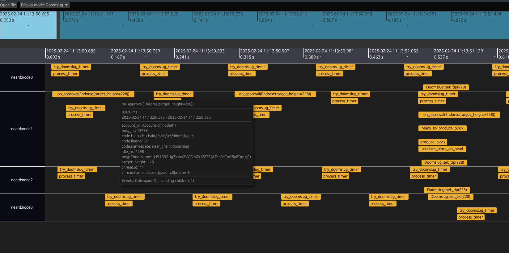

# Traviz

Trace visualizer for NEAR



# How to use

1. Start tracing collector

```console
git clone https://github.com/near/nearcore
cd tracing
docker compose up
```

2. Modify `log_config.json` to output traces from nodes, for example:
```json
{
  "rust_log": "debug",
  "verbose_module": null,
  "opentelemetry": "debug"
}
```

3. Modify `config.json` to send traces to the collector, for example:
```json
"telemetry": {
    "endpoints": ["http://127.0.0.1:4317"],
    "reporting_interval": {
      "secs": 10,
      "nanos": 0
    }
  }
```

4. Run the nodes, collector should be outputting:
```console
Persisting trace of size .. bytes
Persisting trace of size .. bytes
Persisting trace of size .. bytes
```

5. Download the trace from the collector
```console
curl -X POST http://127.0.0.1:8080/raw_trace -H 'Content-Type: application/json' -d "{\"start_timestamp_unix_ms\": $START_TIME, \"end_timestamp_unix_ms\": $END_TIME, \"filter\": {\"nodes\": [],\"threads\": []}}" -o trace.json
```

6. Start `traviz` and open the trace file. Choose the right display mode and explore.
```
cargo run --release
```